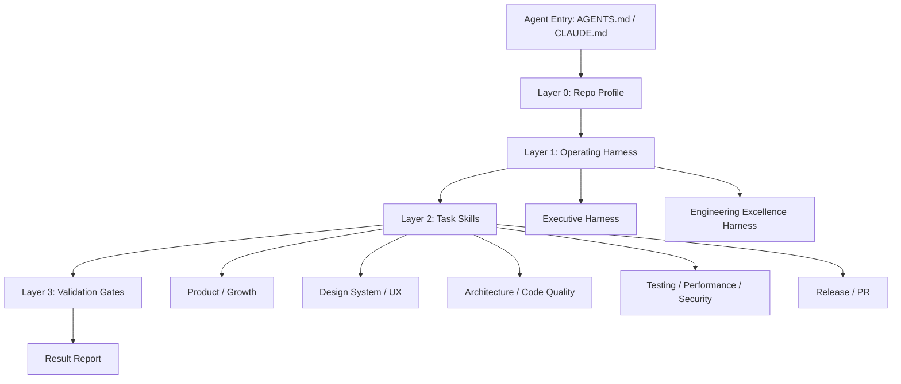
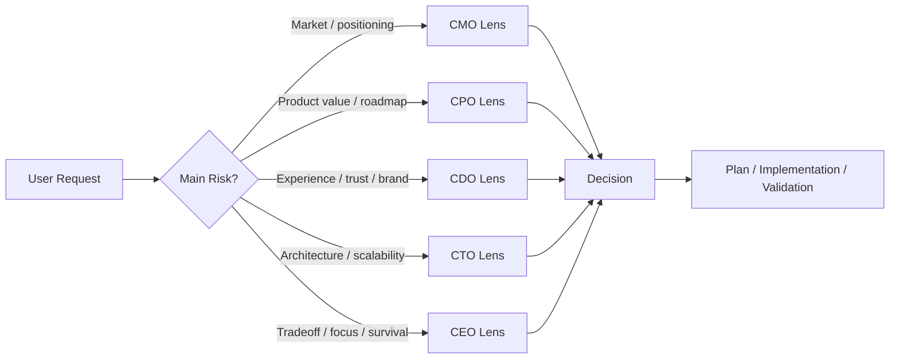
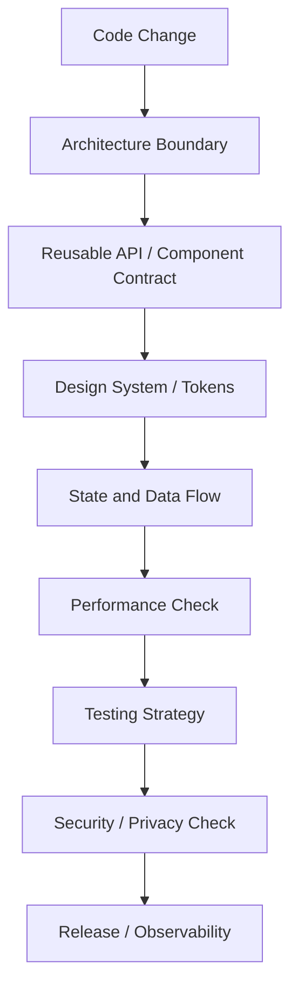

# Universal Agent Skillset Blueprint

이 문서는 어떤 레포에도 복사해 사용할 수 있는 개인용 에이전트 스킬셋의 목표 구조를 정의한다. 목적은 단순한 코드 스타일 규칙 모음이 아니라, 성공적인 프로젝트 운영에 필요한 전략/제품/마케팅/디자인/기술 판단과 코드 인프라 품질을 함께 끌어올리는 것이다.

## 1. Design Goals

| Goal | Meaning |
|---|---|
| Portable | 특정 회사, 도메인, 프레임워크에 묶이지 않고 어떤 레포에도 적용 가능해야 한다. |
| Layered | 항상 읽어야 하는 운영 규칙과, 상황별로 읽는 전문 스킬을 분리한다. |
| Evidence-based | 감이나 취향보다 로그, 코드, 사용자 흐름, 검증 결과에 근거해 판단한다. |
| Executive-grade | CEO/CMO/CDO/CPO/CTO 관점의 질문을 통해 제품 성공 확률을 높인다. |
| Engineering-grade | 코드 품질, 재사용성, 디자인 시스템, 테스트, 성능, 보안, 배포 안정성을 기본값으로 만든다. |
| Progressive disclosure | 스킬 본문은 짧게 유지하고, 상세 기준은 필요할 때만 참조하게 한다. |

## 2. Target Architecture

```text
.agent-core/
  README.md
  blueprints/
    skill-template.md
    profile-template.md
  profiles/
    template.md
    <repo-profile>.md
  skills/
    index.md
    project-profile-selector.md
    skill-system-architect.md
    executive-operating-harness.md
    engineering-excellence-harness.md
    code-style.md
    design-system.md
    testing.md
    react-best-practice.md
    performance.md              # planned
    architecture-boundaries.md   # planned
    security-privacy.md          # planned
    analytics-decisioning.md     # planned
    release-operations.md        # planned
.codex/
  AGENTS.md
.claude/
  CLAUDE.md
scripts/
  bootstrap.sh
```

## 3. Skill Layers



### Layer 0: Repo Profile

Always load or infer the active repo profile before touching files.

Profile must define:

- stack and runtime
- package manager
- validation commands
- path aliases
- code conventions
- high-risk domains
- deployment/release constraints

### Layer 1: Operating Harness

Use this layer to decide what kind of problem is being solved before implementation.

| Harness | Purpose |
|---|---|
| `executive-operating-harness` | CEO/CMO/CDO/CPO/CTO 관점으로 제품/사업/디자인/기술 판단을 정렬한다. |
| `engineering-excellence-harness` | 코드 인프라, 품질 기준, 재사용성, 성능, 검증 기준을 정렬한다. |
| `skill-system-architect` | 스킬 자체를 설계/정비/분리/검증할 때 사용한다. |

### Layer 2: Task Skills

Task skills are narrower and execution-oriented.

| Task | Skill Examples |
|---|---|
| UI/component implementation | `design-system`, `code-style`, `react-best-practice` |
| Architecture refactor | `architecture-boundaries`, `engineering-excellence-harness` |
| Performance work | `performance`, `testing` |
| Product strategy | `executive-operating-harness` |
| Growth/positioning | `executive-operating-harness`, future `growth-positioning` |
| Release/PR | `pr-checklist`, future `release-operations` |
| Skill creation/update | `skill-system-architect` |

### Layer 3: Validation Gates

Every skill should define a completion gate. Examples:

- code: lint, typecheck, test/build
- product: target user, problem, value proposition, success metric
- design: component reuse, token use, accessibility, visual consistency
- growth: acquisition channel, message, funnel metric, risk
- release: version/source of truth, store metadata, rollback risk

## 4. Executive Harness Model



### Lens Definitions

| Lens | Primary Question | Output |
|---|---|---|
| CEO | What is the highest-leverage move under constraints? | focus, sequencing, tradeoff |
| CPO | What user problem are we solving and how do we know? | product hypothesis, roadmap slice |
| CMO | Why will users care and how will they discover it? | positioning, message, funnel |
| CDO | Does the experience feel trustworthy, distinct, and usable? | UX principle, design direction |
| CTO | Can this be built, maintained, measured, and scaled safely? | architecture, risk, validation |

## 5. Engineering Excellence Model



### Engineering Quality Pillars

| Pillar | Guardrail |
|---|---|
| Architecture | separate screen/state/service/domain concerns |
| Reusability | prefer explicit contracts over copy-paste and boolean prop growth |
| Design system | use existing components/tokens before custom UI |
| Type safety | no new `any`; define boundaries and validation |
| Performance | avoid unnecessary re-render, expensive work in render, unstable list refs |
| Testing | focus on risky user flows and regression-prone utilities |
| Privacy/security | do not leak sensitive content to analytics/logs/share outputs |
| Release | verify build targets, environment, metadata, rollback notes |

## 6. Skill Standard

Every reusable skill should answer these questions:

1. When should this skill trigger?
2. What must the agent inspect before acting?
3. What decisions must be made before editing?
4. What rules are non-negotiable?
5. What output format should be produced?
6. What validation proves the work is done?
7. What should be escalated to the user?

## 7. Recommended Skill File Shape

For lightweight `.agent-core/skills/*.md` skills:

```text
# Skill Name

## Purpose
## Trigger
## Required Context
## Operating Loop
## Decision Rules
## Validation Gate
## Output Format
## Escalation
```

For formal Codex skills, use folder-based `SKILL.md` structure:

```text
skill-name/
  SKILL.md
  agents/openai.yaml          # optional but recommended
  references/                 # optional
  scripts/                    # optional
  assets/                     # optional
```

Keep formal `SKILL.md` concise. Move detailed checklists, examples, and domain tables to `references/`.

## 8. Current Repo Migration Plan

### Phase 1: Stabilize the system

- Add this blueprint and templates.
- Add the three meta skills:
  - `skill-system-architect`
  - `executive-operating-harness`
  - `engineering-excellence-harness`
- Update `.codex/AGENTS.md` and `.claude/CLAUDE.md` load order.

### Phase 2: Split overloaded skills

- Split `code-style` into architecture, typing, API/data, and style boundaries if it grows too large.
- Split `design-system` into design-system usage and design critique if needed.
- Add `performance`, `security-privacy`, `release-operations`, `analytics-decisioning`.

### Phase 3: Formalize Codex-compatible skills

- Convert stable `.agent-core/skills/*.md` into formal `SKILL.md` folders only when they prove reusable.
- Keep `.agent-core/skills/*.md` as vendor-neutral source of truth if Claude/Codex must share the same material.
- Generate symlinks or deployment scripts instead of duplicating content.

## 9. Anti-patterns

- Do not create a giant single “do everything” skill.
- Do not encode project-specific package names in core skills.
- Do not put volatile release numbers or temporary branch names in reusable skills.
- Do not make skills so strict that agents cannot adapt to repo conventions.
- Do not make skills so vague that they become inspirational text instead of operational guidance.

## 10. Success Criteria

A repo using this skillset should let an agent answer these quickly:

- What profile and validation commands apply here?
- What is the smallest safe change?
- Which quality gates are mandatory?
- What product/business/design/technical tradeoffs matter?
- What should be reused instead of recreated?
- What risks must be reported before completion?
