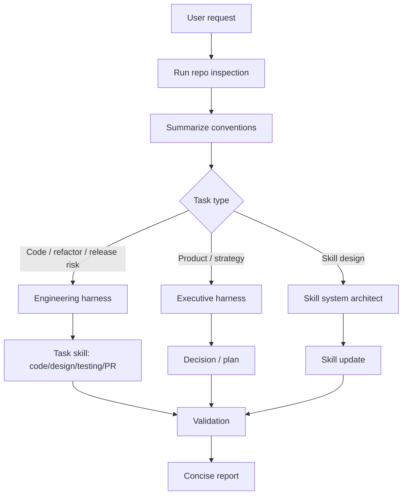

# Universal Agent Skillset Blueprint

A portable skillset should help an agent understand the current repo quickly, choose only the relevant operating skill, act with local conventions, and validate without wasting context.

## 1. Principles

| Principle | Rule |
|---|---|
| Context first | Inspect the repo before applying generic advice. |
| Automation before repetition | Use scripts for repeated convention discovery. |
| Progressive disclosure | Load only the skill needed for the current task. |
| Local conventions win | Follow the target repo unless unsafe or explicitly changing it. |
| Evidence over intuition | Base claims on files, commands, tests, logs, or user-visible behavior. |
| Portable core | Keep company, project, release, and branch details out of reusable skills. |

## 2. Target Architecture

```text
.agent-core/
  blueprints/
    skill-template.md
    profile-template.md
  scripts/
    inspect-repo.sh
  skills/
    index.md
    repo-convention-intelligence.md
    engineering-excellence-harness.md
    executive-operating-harness.md
    intent-capture.md
    skill-system-architect.md
    verification-layer.md
    code-style.md
    design-system.md
    testing.md
    pr-checklist.md
.codex/AGENTS.md
.claude/CLAUDE.md
```

## 3. Operating Flow



## 4. Context Budget Policy

The agent should not repeatedly load the same broad context.

1. Run `.agent-core/scripts/inspect-repo.sh .` first when available.
2. Read root agent docs and nearby files only when the script output is insufficient.
3. Do not read all skills by default.
4. Do not read framework-specific references unless the repo actually uses that framework.
5. Preserve a short `[Repo Context]` summary in the task and reuse it.
6. Stop exploration when commands, architecture boundary, reusable surface, and risk level are clear.

## 5. Executive Harness

Use `executive-operating-harness` for roadmap, growth, monetization, positioning, and product direction.

| Lens | Question |
|---|---|
| CEO | What is the highest-leverage move under constraints? |
| CPO | What user problem and behavior change matter most? |
| CMO | Why will users care, remember, and share? |
| CDO | Is the experience distinct, usable, and trustworthy? |
| CTO | Can this be built, measured, maintained, and released safely? |

## 6. Engineering Harness

Use `engineering-excellence-harness` for non-trivial code work.

| Pillar | Guardrail |
|---|---|
| Architecture | separate UI, state, domain, service, and config concerns |
| Reuse | search existing components/services/hooks before adding new ones |
| Type safety | avoid new `any`; validate unknown boundaries |
| Design system | use existing components/tokens before custom UI |
| Performance | avoid unnecessary render work and unstable list references |
| Testing | validate based on risk and available tooling |
| Privacy/security | avoid leaking user content to logs, analytics, exports |
| Release | verify source of truth, environment, and rollback risk |

## 7. Skill Standard

A reusable skill must include:

- purpose
- trigger
- required context
- operating loop
- decision rules
- validation gate
- escalation criteria

A skill should not include:

- volatile release numbers
- branch names
- project secrets
- framework rules that only apply to one repo
- long examples that belong in references
- inspirational text without operational effect

## 8. Intent And Verification

AI-assisted work creates two recurring costs:

- intent debt: useful context, constraints, and judgment stay in a person's head or one chat session
- verification tax: generated output looks plausible but still needs checks before it can be trusted

The portable skillset should therefore include two explicit behaviors:

- `intent-capture`: ask focused questions, extract tacit knowledge, and store durable lessons in the right artifact
- `verification-layer`: define binary checks, quantitative metrics, and qualitative rubrics before trusting generated output

These skills should be loaded only when triggered. They are not a reason to turn every task into a long planning ritual.

## 9. Profile Strategy

Profiles are optional. Create one only when a repo will be revisited often or has non-obvious conventions.

Use `.agent-core/blueprints/profile-template.md` as the template. Store the generated profile in the target repo or a project-specific config area, not in the portable core unless it is truly generic.

## 10. Migration Plan

1. Remove old framework-specific profiles and overloaded skills.
2. Make `repo-convention-intelligence` the first step for every repo.
3. Keep default entry files small and pointer-based.
4. Add automation scripts for repeated inspection.
5. Split future skills only when a repeated task proves stable.

## 11. Success Criteria

A fresh agent should be able to answer quickly:

- What stack and package manager does this repo use?
- Which validation commands apply?
- What local conventions should be followed?
- Which existing components/services can be reused?
- Which skill is relevant to this request?
- What validation evidence proves completion?
