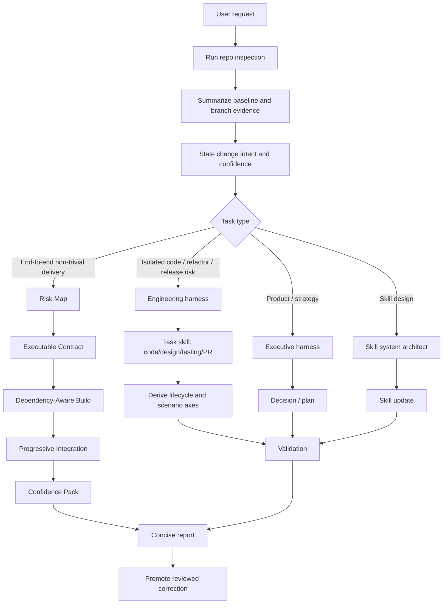

# Universal Agent Skillset Blueprint

A portable skillset should help an agent understand the current repo quickly, choose only the relevant operating skill, act with local conventions, and validate without wasting context.

## 1. Principles

| Principle | Rule |
|---|---|
| Context first | Inspect the repo before applying generic advice. |
| Intent before tooling | Derive changed behavior before selecting a runner or test layer. |
| Explicit uncertainty | Separate observed, inferred, and human-reviewed knowledge. |
| Automation before repetition | Use scripts for repeated convention discovery. |
| Progressive disclosure | Load only the skill needed for the current task. |
| Local conventions win | Follow the target repo unless unsafe or explicitly changing it. |
| Evidence over intuition | Base claims on files, commands, tests, logs, or user-visible behavior. |
| Correction as memory | Promote accepted corrections, not raw output, into shared baselines. |
| Portable core | Keep company, project, release, and branch details out of reusable skills. |

## 2. Target Architecture

```text
.agent-core/
  blueprints/
    skill-template.md
    profile-template.md
    verification-baseline-template.md
  scripts/
    inspect-repo.sh
  skills/
    index.md
    repo-convention-intelligence.md
    risk-to-confidence/
      SKILL.md
      references/
        artifact-contracts.md
        repository-adapter.md
      agents/
        openai.yaml
    engineering-excellence-harness.md
    executive-operating-harness.md
    intent-capture.md
    taste-calibration.md
    skill-system-architect.md
    verification-layer.md
    code-style.md
    design-system.md
    testing.md
    pr-checklist.md
.agents/skills/risk-to-confidence -> ../../.agent-core/skills/risk-to-confidence
.codex/AGENTS.md
.claude/
  CLAUDE.md
  skills/risk-to-confidence -> ../../.agent-core/skills/risk-to-confidence
```

## 3. Operating Flow


```mermaid
flowchart TD
    A[User request] --> B[Run repo inspection]
    B --> C[Summarize baseline and branch evidence]
    C --> C2[State change intent and confidence]
    C2 --> D{Task type}
    D -- Product / strategy --> E[Executive harness]
    D -- End-to-end non-trivial delivery --> R1[Risk Map]
    D -- Isolated code / refactor / release risk --> F[Engineering harness]
    D -- Skill design --> G[Skill system architect]
    R1 --> R2[Executable Contract]
    R2 --> R3[Dependency-Aware Build]
    R3 --> R4[Progressive Integration]
    R4 --> R5[Confidence Pack]
    R5 --> L
    F --> H[Task skill: code/design/testing/PR]
    E --> I[Decision / plan]
    G --> J[Skill update]
    H --> H2[Derive lifecycle and scenario axes]
    H2 --> K[Validation]
    I --> K
    J --> K
    K --> L[Concise report]
    L --> M[Promote reviewed correction]
```

### Risk-to-Confidence Routing Boundary

- Select R2C automatically only when a non-trivial request spans contract, implementation, integration, and evidence.
- An explicit R2C request may stop after an earlier named gate without authorizing later phases.
- Use an existing stage skill for isolated review, implementation, design, testing, QA, or commit work.
- Keep artifacts in the conversation unless the user supplies a location or authorizes an existing repository convention.

## 4. Context Budget Policy

The agent should not repeatedly load the same broad context.

1. Run `.agent-core/scripts/inspect-repo.sh .` first when available.
2. Read root agent docs and nearby files only when the script output is insufficient.
3. Do not read all skills by default.
4. Do not read framework-specific references unless the repo actually uses that framework.
5. Preserve a short `[Repo Context]` summary in the task and reuse it.
6. Preserve a separate `[Change Context]` with default ref, commits, changed files, intent, evidence, and confidence.
7. Stop exploration when commands, architecture boundary, changed behavior, reusable surface, and risk level are clear.

## 5. Executive Harness

Use `executive-operating-harness` for roadmap, growth, monetization, positioning, and product direction.

| Lens | Question |
|---|---|
| CEO | What is the highest-leverage move under constraints? |
| CPO | What user problem and behavior change matter most? |
| CMO | Why will users care, remember, and share? |
| CDO | Is the experience distinct, usable, and trustworthy? |
| CTO | Can this be built, measured, maintained, and released safely? |

## 6. Engineering Harness

Use `engineering-excellence-harness` for non-trivial code work.

| Pillar | Guardrail |
|---|---|
| Architecture | preserve existing boundaries and isolate responsibilities and interfaces |
| Reuse | search existing modules, components, services, scripts, and configuration before adding new ones |
| Type and schema safety | preserve declared contracts and validate unknown boundaries |
| Design and presentation | follow existing conventions and reusable assets when the change has a presentation surface |
| Performance | target observed hot paths and avoid unnecessary work |
| Testing | derive lifecycle and scenario axes before selecting test tooling |
| Privacy/security | avoid leaking sensitive data through logs, telemetry, artifacts, or exports |
| Release | verify source of truth, environment, and rollback risk |

## 7. Skill Standard

This repository supports two skill forms:

- A flat operational skill at `.agent-core/skills/<name>.md` keeps a lightweight, vendor-neutral rule set.
- A formally discoverable package at `.agent-core/skills/<name>/SKILL.md` has valid `name` and `description` frontmatter, procedural instructions, optional package-local `references/` and `agents/`, and thin discovery adapters.

A flat operational skill should make these elements explicit:

- purpose
- trigger
- required context
- operating loop
- decision rules
- validation gate
- escalation criteria

For a formal package, the description owns discovery and trigger boundaries; the body must still make operating steps, transition or completion criteria, and fallback behavior clear. Keep package-only references under the package directory. Use `.agent-core/references` only for material shared by multiple skills.

A skill should not include:

- volatile release numbers
- branch names
- project secrets
- framework rules that only apply to one repo
- long examples that belong in references
- inspirational text without operational effect

## 8. Intent And Verification

AI-assisted work creates two recurring costs:

- intent debt: useful context, constraints, and judgment stay in a person's head or one chat session
- verification tax: generated output looks plausible but still needs checks before it can be trusted
- taste drift: agents repeatedly ask the user to re-explain what good, polished, or trustworthy means

The portable skillset should therefore include three explicit behaviors:

- `intent-capture`: ask focused questions, extract tacit knowledge, and store durable lessons in the right artifact
- `taste-calibration`: convert implicit quality judgment into compact rubrics, examples, and failure signs
- `verification-layer`: define binary checks, quantitative metrics, and qualitative rubrics before trusting generated output

These skills should be loaded only when triggered. They are not a reason to turn every task into a long planning ritual.

For change-bearing work, use this compact evidence chain:

```text
user request + commits + diff + reviewed baseline
  -> intent and confidence
  -> trigger / precondition / action / state / side effect / outcome
  -> primary / failure / boundary / state-transition scenarios
  -> generated checks
  -> executed evidence
  -> reviewed correction
```

Use `blueprints/verification-baseline-template.md` only when a repo has repeated, non-obvious verification knowledge. The default branch is the shared baseline; a feature branch proposes changes to it.

## 9. Profile Strategy

Profiles are optional. Create one only when a repo will be revisited often or has non-obvious conventions.

Use `.agent-core/blueprints/profile-template.md` as the template. Store the generated profile in the target repo or a project-specific config area, not in the portable core unless it is truly generic.

## 10. Migration Plan

1. Remove old framework-specific profiles and overloaded skills.
2. Make `repo-convention-intelligence` the first step for every repo.
3. Keep default entry files small and pointer-based.
4. Add automation scripts for repeated inspection.
5. Split future skills only when a repeated task proves stable.

## 11. Success Criteria

A fresh agent should be able to answer quickly:

- What stack and dependency or build system does this repo use?
- Which validation commands apply?
- What behavior is this branch intended to change, and what evidence supports that interpretation?
- Which scenario axes apply, and which remain uncertain?
- What local conventions should be followed?
- Which existing modules, services, assets, or configuration can be reused?
- Which skill is relevant to this request?
- What validation evidence proves completion?
- Which evidence was generated, executed, or explicitly reviewed?
